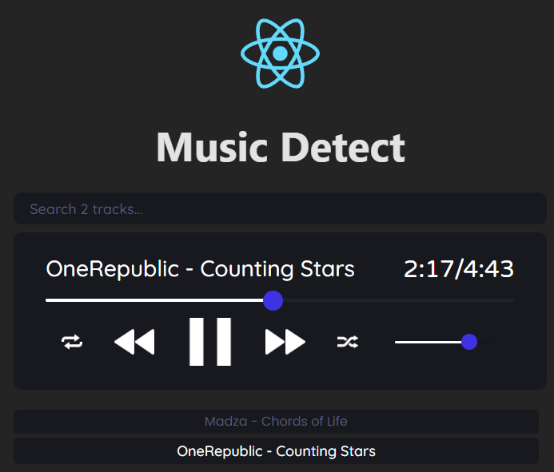
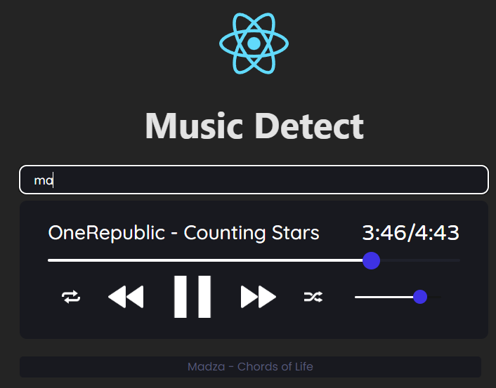
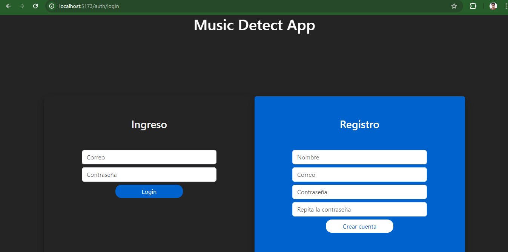
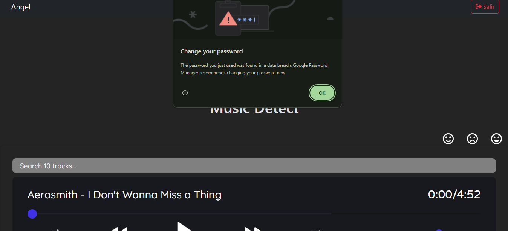
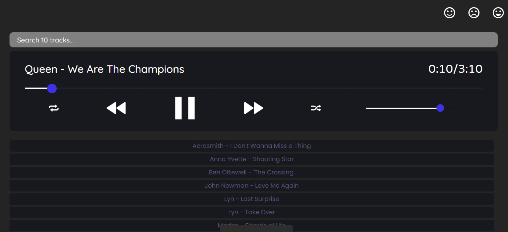
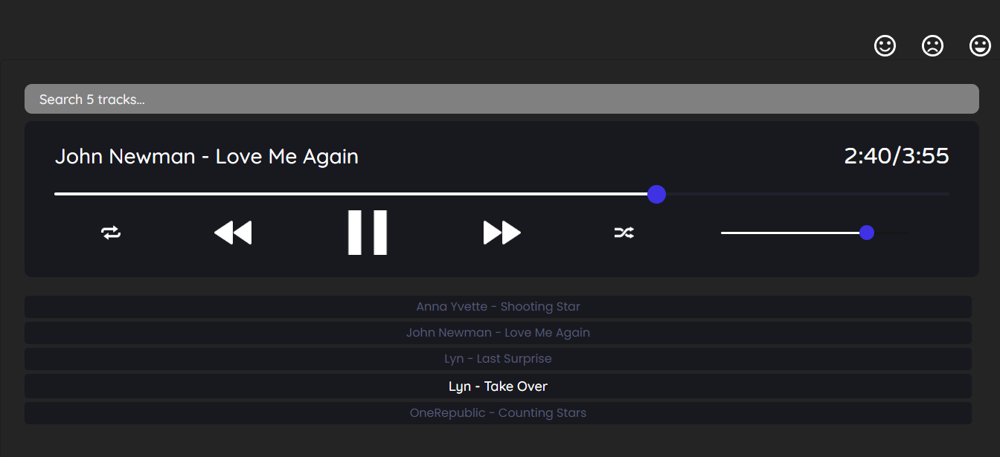

# Music Detect

## Propuesta de proyecto.

Reproductor multimedia Web que muestra recomendaciones personalizadas 
en función del estado de ánimo del usuario. 
(El usuario define cómo se siente).

Especificación del proyecto:
- Inicio de sesión
- Carga de canciones local/remoto
- Funciones básicas de un reproductor: Sig, Prev, Play, Pausa, Volumen, Búsqueda de canciones.
- Recomendación de canciones (aceptar recomendación, generar una nueva).

Tecnologías de desarrollo (MERN Stack)
- React, JS
- IA: TensorFlow (tentativa)
- BD: Mongo

# Music Detect v1.0.0

Reproductor multimedia web el cual como se menciona en las especificaciones
sus funciones basicas son las de: Sig, Prev, Play, Pausa, Volumen, Búsqueda de canciones.

Al realizar alguna busqueda de alguna cancion, no se necesita escribir todo el nombre
simplemente con que incluya dichas letras muestra los posibles resultados.

# Music Detect v1.0.3
## Inicio de sesion
El proyecto cuenta con una ventana login al cargar la aplicacion, hay dos columnas
una de inicio de sesion y la otra de registro en caso de no tener una cuenta.

Esta esta conectada a una base de datos en MongoDB la cual guarda los usuarios que se 
registran y la cual encripta su contraseña por seguridad en la base de datos, una vez
esta registrado un usuario al momento de hacer el login este busca en el backend la
informacion y si es correcta le da acceso al usuario del reproductor.

No cuenta con validacion de contraseñas sin embargo es algo que se puede agregar a futuro
en el proyecto, pero vemos que el login funciona, claro si el backend no esta activo, no 
se podra acceder al reproductor.
Ai ingresar vemos que en el navbar tenemos el nombre del usuario y un boton para salir de
la sesion, asi como el reproductor.

## Reproductor de emociones
En el reproductor podemos observar unos iconos, los cuales serviran como botones y en base 
a la emocion que sientas este te recomendara canciones, este tiene una clasificacion de texto
en la cual dependiendo de esa emocion te mostrara canciones que pudieran transmitirte esa
emocion. Por el momento solo se manejo 3 tipos de emociones, feliz, triste y emocionado.
En un inicio se cargaran la lista de canciones que se tienen guardadas.

Si presionamos alguna de las emociones. Obtenemos una lista de posibles canciones que transmiten
ese sentimiento. Las canciones contienen una etiqueta la cual es la emocion posible.

## Desplegar el proyecto

Para desplegar el proyecto se deberan realizar los siguientes pasos.
1. Local;izar el path de donde se encuentra el proyecto, por medio del cmd utilizar
    `cd "Path-del-proyecto"`, esto para estar en el path donde esta nuestro proyecto
    ya que si estamos en otro lado los comando para realizar el despegue causaran error.
2. Una vez estando en el path del proyecto ejecutamos el siguiente comando:
    `npm run build` en el caso de utilizar npm.
3. Se nos generara una carpeta llamada _dist_ la cual realizaremos una copia de esta y 
    le pondremos el nombre de _docs_ ya que al momento del despligue en un servidor
    este es el nombre _root_ que busca, ademas que por medio del _.gitignore_ esta carpeta
    no se sube a github (en caso de querer desplegar en github)
4. Buscar el sitio donde desplegar el proyecto en este caso para proyectos con React
    **Nestlify** es facil de hacer despligues del proyecto.
5. Nos registramos en Nestlify en caso de no tener cuenta y hay dos maneras de desplegar
    el proyecto:
    1. Arrastramos la carpeta que se nos genero de despligue, esperamos y listo.
    2. Por medio de github, conectamos nuestra cuenta y damos acceso a Nestlify para que 
        busque nuestro repositorio donde esta el proyecto (debera estar publico), 
        una vez lo encuentra lo seleccionamos, esperamos y listo.